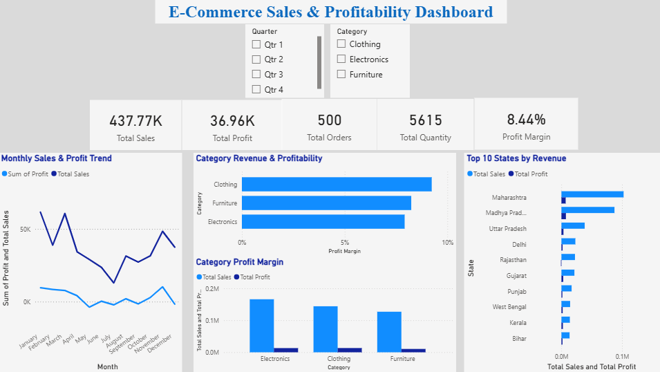
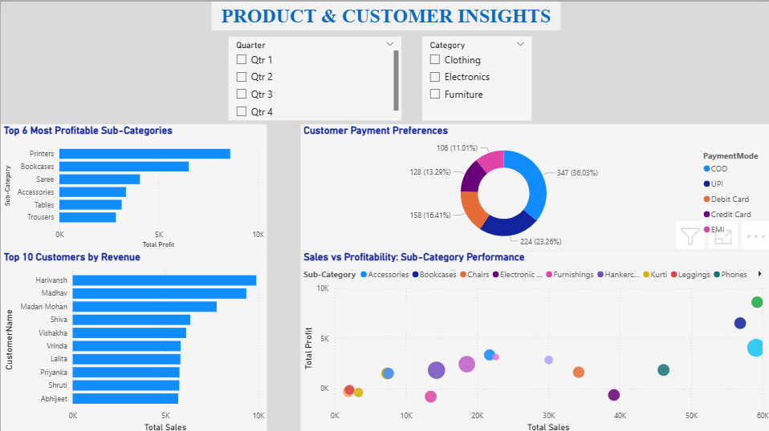
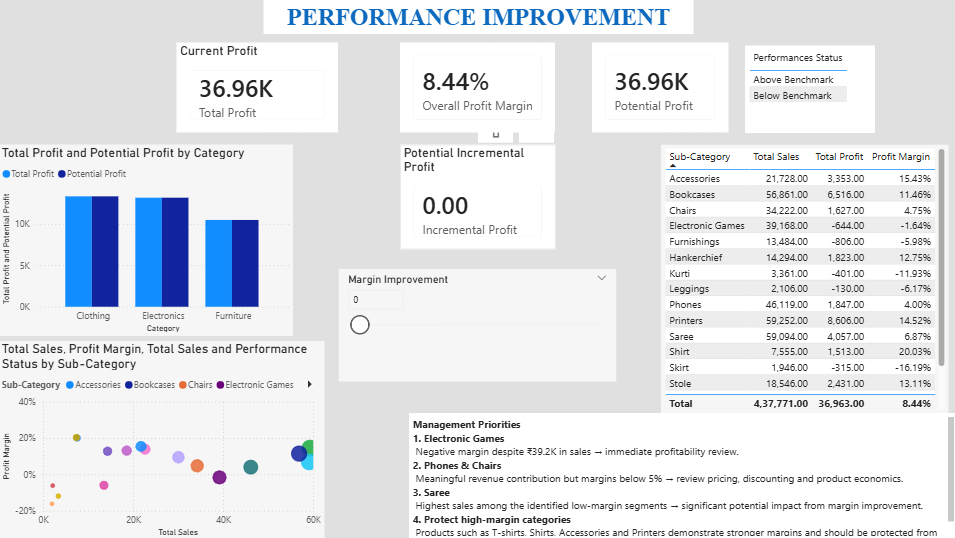

# Sales Performance & Profitability Analysis | Power BI

## Project Overview

An interactive Power BI dashboard developed to analyse sales performance and profitability across products, customers, payment modes and geographies.

The project combines data modelling, DAX-based KPI development and interactive visualisation to move from basic sales reporting toward identifying profitability gaps and potential performance-improvement opportunities.

## Business Objective

The dashboard was designed to answer key business questions:

- How are sales and profitability performing over time?
- Which categories and sub-categories contribute most to revenue?
- Which products generate high sales but relatively low margins?
- Which customers and geographies contribute significantly to performance?
- What payment modes are most commonly used?
- Where are potential profitability improvement areas?

## Dashboard Pages

### 1. Executive Overview

Provides a high-level view of overall business performance, including sales, profit, orders, quantity and monthly trends.

### 2. Product & Customer Insights

Analyses product/sub-category performance, customer contribution, payment-mode preferences and the relationship between sales and profitability.

### 3. Performance Improvement

Uses the overall profit margin as a benchmark to identify sub-categories performing below the business average.

## Key Performance Indicators

| KPI | Value |
|---|---:|
| Total Sales | ₹437.77K |
| Total Profit | ₹36.96K |
| Total Orders | 500 |
| Total Quantity | 5,615 |
| Overall Profit Margin | 8.44% |

## Key Insights

- Overall profit margin stands at 8.44%.
- Electronic Games generated ₹39.17K in sales but had a negative profit margin of -1.64%.
- Phones generated ₹46.12K in sales with a 4.00% profit margin.
- Chairs generated ₹34.22K in sales with a 4.75% profit margin.
- Saree generated ₹59.09K in sales but had a 6.87% profit margin, below the overall benchmark.
- Printers generated ₹59.25K in sales with a 14.52% profit margin.
- Accessories generated a 15.43% profit margin despite lower sales than several larger sub-categories.

## Analytical Approach

The analysis follows a simple performance-improvement logic:

**Sales Performance → Profitability Analysis → Benchmarking → Identify Underperforming Segments**

The overall profit margin of 8.44% was used as a benchmark to identify sub-categories with weaker profitability.

## Tools & Skills

- Microsoft Power BI
- DAX
- Data Modelling
- KPI Development
- Interactive Dashboard Design
- Data Visualisation
- Sales & Profitability Analysis
- Product Segmentation
- Customer Analysis
- Geographic Analysis
- Performance Benchmarking

## Project Files

- `POWERBI- PROJECT - ANWESHA.pbix` — Power BI dashboard
- Dashboard screenshots — visual preview of the three report pages

